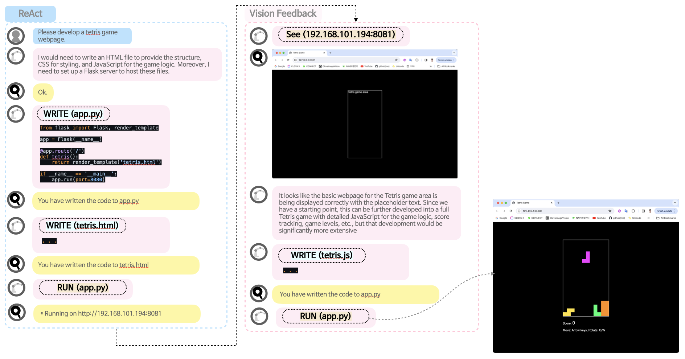

# Web Development AI Agent Evaluation

## Basic Usage
```Bash
python3 run.py --instruction 'Please develop a webpage that displays hello world.' --agent_type 'reflect' --model 'gpt-4-vision-preview'
```

## Agent Architecture



The agent's architecture is based on the [ReAct](https://arxiv.org/abs/2210.03629) framework, which utilizes `think` and `action` steps. However, I observed that the agent often created `.py` files without running them, and after running the app, it failed to thoroughly check its functionality.

To address this issue, I introduced a new action called `see`. This action allows the agent to view its running website and verify if it is functioning as intended. As illustrated in the picture, the agent typically creates a skeleton code for the Tetris game and terminates the task prematurely.

With the addition of the `see` action, the agent can recognize that it has only created a skeleton code. It realizes that it needs to fill in the HTML/CSS/JS components to complete the Tetris game. This enhancement enables the agent to perform a more comprehensive evaluation of its work and make necessary adjustments to ensure the proper functioning of the developed website.

The introduction of the `see` action significantly improves the agent's ability to self-assess and refine its output, leading to more complete and functional web development projects.

## Performance 

This section presents an evaluation of an AI agent's performance on a series of web development tasks. The agent was tested on five test cases with varying levels of complexity. Each test case was designed to assess the agent's ability to complete the task within a maximum of 12 actions (hops). The success rate for each test case was determined through manual human evaluation based on 10 trials.

| No. | Test Case                        | Functionality Test                                                        | Success Rate |
|-----|----------------------------------|--------------------------------------------------------------------------|--------------|
| 1   | Hello World Webpage             | Verify the page correctly displays the text.                              | 100%         |
| 2   | Interactive Box Movement Webpage | Check if the box can be moved smoothly with mouse interactions.           | 90%          |
| 3   | Page Views Counter Webpage      | Ensure the total count of views is stored and updated with each new visit. | 90%          |
| 4   | Neumorphic Style Todo Webpage   | Test the addition, deletion, and visibility of todos.                     | 90%          |
| 5   | Tetris Game Webpage             | Test full game functionality including block generation and game over logic. | 20%          |

**Key Findings:**
- The AI agent excelled in basic web development tasks (Test Cases 1-4).
- The agent demonstrated proficiency in styling webpages using the neumorphism design style (Test Case 4).
- **The agent struggled with complex tasks involving game development and advanced logic (Test Case 5).**

The evaluation reveals that while the AI agent is highly capable of handling fundamental web development tasks, it faces significant difficulties in developing intricate applications like Tetris. The agent's inability to effectively identify and resolve issues in complex codebases highlights the need for further advancements in its debugging and error recovery capabilities.

